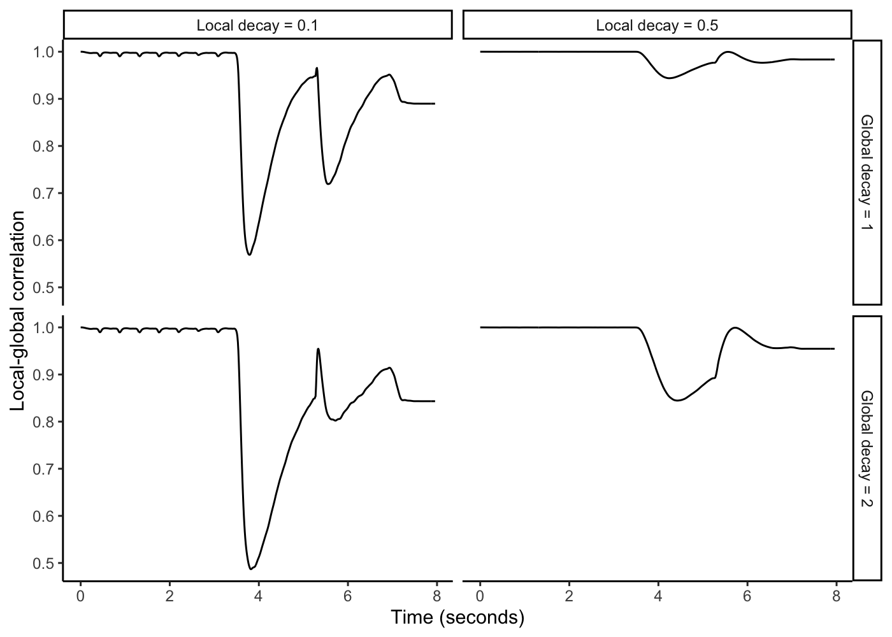

<!-- README.md is generated from README.Rmd. Please edit that file -->

# leman2000R

*Author: Peter Harrison*

<!-- badges: start -->
<!-- badges: end -->

This package allows you to run the tonal contextuality model of Leman
(2000) on arbitrary audio files. The original model was published in a
2000 Music Perception paper, and was shown to provide a psychoacoustic
account of the Krumhansl-Kessler probe-tone data. Leman and colleagues
released this model a while back as part of the IPEM Toolbox, but this
now only works on old versions of MATLAB. The present package wraps this
old implementation in Docker to ensure easy cross-platform use into the
forseeable future.

## Installation

You can install the development version of leman2000R from
[GitHub](https://github.com/) with:

``` r
install.packages("remotes")
remotes::install_github("pmcharrison/leman2000R")
```

You must also install [Docker](https://docker.io/) and launch it on your
computer before using the package.

Run `?leman2000R::leman2000` in your R console to get documentation for
the main function, `leman2000`.

## Example

Note: this example also depends on the `tidyverse` package, which you
can install using `install.packages("tidyverse")`.

``` r
library(tidyverse)
#> ── Attaching packages ─────────────────────────────────────── tidyverse 1.3.1 ──
#> ✔ ggplot2 3.4.0      ✔ purrr   0.3.5 
#> ✔ tibble  3.1.8      ✔ dplyr   1.0.10
#> ✔ tidyr   1.2.1      ✔ stringr 1.5.0 
#> ✔ readr   2.1.2      ✔ forcats 0.5.1
#> ── Conflicts ────────────────────────────────────────── tidyverse_conflicts() ──
#> ✖ dplyr::filter() masks stats::filter()
#> ✖ dplyr::lag()    masks stats::lag()

library(leman2000R)

theme_set(theme_classic())

res <- leman2000(
  input_file = "inst/bVII_eGuitar_A.wav",
  local_decay_sec = c(0.1, 0.5),
  global_decay_sec = c(1, 2),
  windows = list(c(3.5, 5.225), c(5.225, 6.885))
)
#> ------------------------------------------
#> Setting up environment variables
#> ---
#> LD_LIBRARY_PATH is .:/opt/mcr/v84/runtime/glnxa64:/opt/mcr/v84/bin/glnxa64:/opt/mcr/v84/sys/os/glnxa64:/opt/mcr/v84/sys/opengl/lib/glnxa64
#> Start of IPEMCalcANI...
#> 
#> Filterbank data: fssig = 22.050 kHz en fsmp = 44.100 kHz
#>   1: fc(kHz),fsk(kHz),uc(cbu),step =   0.141 11.025  2.000  3  4
#>   2: fc(kHz),fsk(kHz),uc(cbu),step =   0.178 11.025  2.500  3  4
#>   3: fc(kHz),fsk(kHz),uc(cbu),step =   0.215 11.025  3.000  3  4
#>   4: fc(kHz),fsk(kHz),uc(cbu),step =   0.252 11.025  3.500  3  4
#>   5: fc(kHz),fsk(kHz),uc(cbu),step =   0.291 11.025  4.000  3  4
#>   6: fc(kHz),fsk(kHz),uc(cbu),step =   0.331 11.025  4.500  3  4
#>   7: fc(kHz),fsk(kHz),uc(cbu),step =   0.372 11.025  5.000  3  4
#>   8: fc(kHz),fsk(kHz),uc(cbu),step =   0.415 11.025  5.500  3  4
#>   9: fc(kHz),fsk(kHz),uc(cbu),step =   0.460 11.025  6.000  3  4
#>  10: fc(kHz),fsk(kHz),uc(cbu),step =   0.507 11.025  6.500  3  4
#>  11: fc(kHz),fsk(kHz),uc(cbu),step =   0.557 11.025  7.000  3  4
#>  12: fc(kHz),fsk(kHz),uc(cbu),step =   0.609 11.025  7.500  3  4
#>  13: fc(kHz),fsk(kHz),uc(cbu),step =   0.665 11.025  8.000  3  4
#>  14: fc(kHz),fsk(kHz),uc(cbu),step =   0.724 11.025  8.500  3  4
#>  15: fc(kHz),fsk(kHz),uc(cbu),step =   0.789 11.025  9.000  3  4
#>  16: fc(kHz),fsk(kHz),uc(cbu),step =   0.858 11.025  9.500  3  4
#>  17: fc(kHz),fsk(kHz),uc(cbu),step =   0.934 11.025 10.000  3  4
#>  18: fc(kHz),fsk(kHz),uc(cbu),step =   1.018 11.025 10.500  3  4
#>  19: fc(kHz),fsk(kHz),uc(cbu),step =   1.111 11.025 11.000  3  4
#>  20: fc(kHz),fsk(kHz),uc(cbu),step =   1.215 11.025 11.500  3  4
#>  21: fc(kHz),fsk(kHz),uc(cbu),step =   1.333 11.025 12.000  3  4
#>  22: fc(kHz),fsk(kHz),uc(cbu),step =   1.468 11.025 12.500  3  4
#>  23: fc(kHz),fsk(kHz),uc(cbu),step =   1.622 11.025 13.000  3  4
#>  24: fc(kHz),fsk(kHz),uc(cbu),step =   1.792 11.025 13.500  3  4
#>  25: fc(kHz),fsk(kHz),uc(cbu),step =   1.981 11.025 14.000  3  4
#>  26: fc(kHz),fsk(kHz),uc(cbu),step =   2.189 11.025 14.500  3  4
#>  27: fc(kHz),fsk(kHz),uc(cbu),step =   2.419 11.025 15.000  3  4
#>  28: fc(kHz),fsk(kHz),uc(cbu),step =   2.674 11.025 15.500  3  4
#>  29: fc(kHz),fsk(kHz),uc(cbu),step =   2.955 22.050 16.000  2  2
#>  30: fc(kHz),fsk(kHz),uc(cbu),step =   3.266 22.050 16.500  2  2
#>  31: fc(kHz),fsk(kHz),uc(cbu),step =   3.609 22.050 17.000  2  2
#>  32: fc(kHz),fsk(kHz),uc(cbu),step =   3.989 22.050 17.500  2  2
#>  33: fc(kHz),fsk(kHz),uc(cbu),step =   4.408 22.050 18.000  2  2
#>  34: fc(kHz),fsk(kHz),uc(cbu),step =   4.872 22.050 18.500  2  2
#>  35: fc(kHz),fsk(kHz),uc(cbu),step =   5.384 22.050 19.000  2  2
#>  36: fc(kHz),fsk(kHz),uc(cbu),step =   5.951 44.100 19.500  1  1
#>  37: fc(kHz),fsk(kHz),uc(cbu),step =   6.577 44.100 20.000  1  1
#>  38: fc(kHz),fsk(kHz),uc(cbu),step =   7.268 44.100 20.500  1  1
#>  39: fc(kHz),fsk(kHz),uc(cbu),step =   8.033 44.100 21.000  1  1
#>  40: fc(kHz),fsk(kHz),uc(cbu),step =   8.877 44.100 21.500  1  1
#> low_ch: 1 36 29 36 
#> Td,Tm,delay,Ne =  1.088  0.615  1.703   4
#> Analysing input.wav
#> sampling frequency (hexa): 34 86 0 0
#> sample width: 16
#> nsamp: 353320
#> Ended dll, ready for downsampling if needed...
#> ...end of IPEMCalcANI.
#> Start of IPEMPeriodicityPitch...
#> Size of input signal is [40,21972]
#> inSampleFreq    = 2756.25 Hz
#> inLowFrequency  = 80 Hz
#> inFrameWidth    = 0.064 s
#> inFrameStepSize = 0.010 s
#> inPlotFlag      = 0
#> outSampleFreq   = 98.44 Hz
#> Filtering ANI using a second-order lowpass filter at 80 Hz ... Done.
#> Calculating periodicity using autocorrelation... ..............................Done.
#> ...end of IPEMPeriodicityPitch.
#> Computing running correlation 1/4...
#> Computing running correlation 2/4...
#> Computing running correlation 3/4...
#> Computing running correlation 4/4...

res$local_global_comparison |>
  mutate(
    global_decay_sec = paste("Global decay =", global_decay_sec),
    local_decay_sec = paste("Local decay =", local_decay_sec),
  ) |>
  ggplot(aes(time_sec, running_correlation)) +
  scale_x_continuous("Time (seconds)") +
  scale_y_continuous("Local-global correlation") +
  geom_line() +
  facet_grid(global_decay_sec ~ local_decay_sec)
```



``` r


res$windowed_local_global_comparison |>
  mutate(
    global_decay_sec = paste("Global decay =", global_decay_sec),
    local_decay_sec = paste("Local decay =", local_decay_sec),
    window_label = sprintf("%.2fs - %.2fs", window_start, window_end)
  ) |>
  ggplot(aes(window_label, local_global_correlation)) +
  scale_x_discrete("Window") +
  scale_y_continuous("Local-global correlation") +
  geom_bar(stat = "identity") +
  facet_grid(global_decay_sec ~ local_decay_sec)
```


